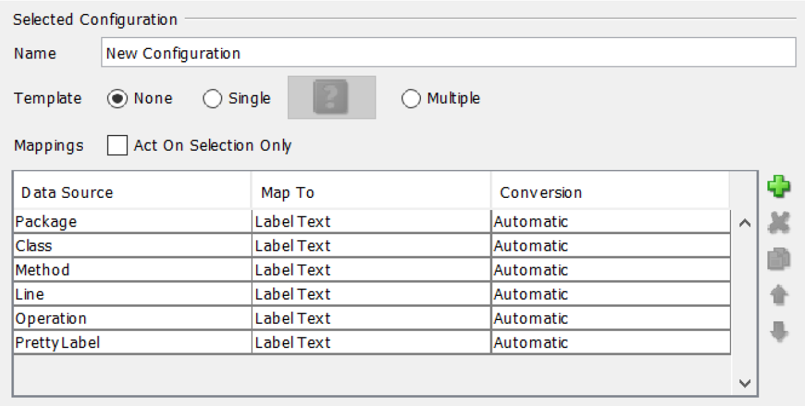

# Taint Analysis For Privacy Experimental Results

## Repository content

The repository contains the XML results of the analysis of
- WebGoat 6.0.1
- blojsom 3.3b
- bluebog 0.9
- riki 1.3.0
- gestcv 1.0.0
- jboard 0.30 
- jspwiki 2.11
- jugjobs  
- pebble 2.6.4
- personal vel.
- photov 2.1
- roller 0.9.6
- snipsnap 0.7

and taint graphs of
- WebGoat 6.0.1

## How to view the taint graphs

The taint graphs are contained in taint_graphs.zip. They are represented as hierarchical graphml files. These can be visualized using the yEd graph editor (https://www.yworks.com/products/yed) and then by:

- unzip the archive,
- opening the file to view using yEd graph editor,
- selecting menu Edit -> Properties mapper, and then setting up the configuration below (in this way the visualization will allow to see all the hierarchical levels reported inside the graphml file),

- selecting menu Layout -> Hierarchical and clicking button “Ok” (no need to customize the configuration).